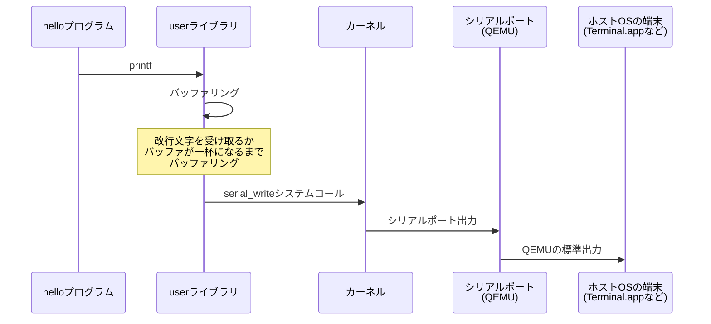
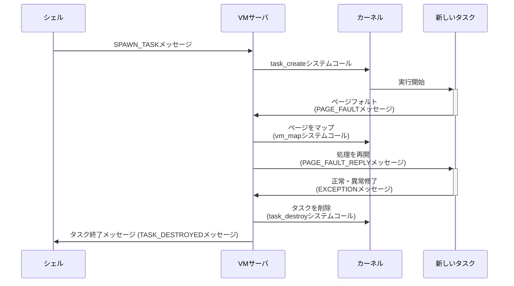
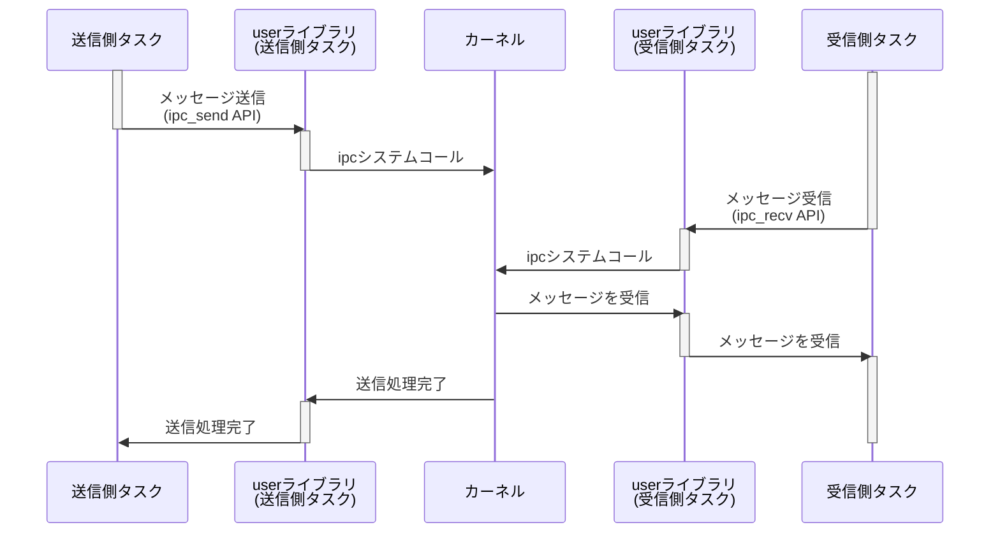
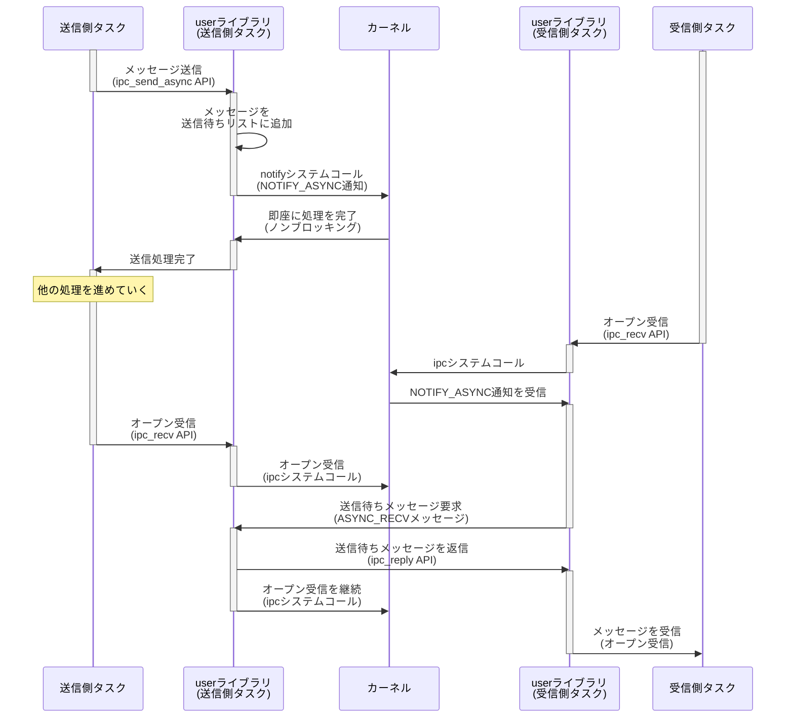
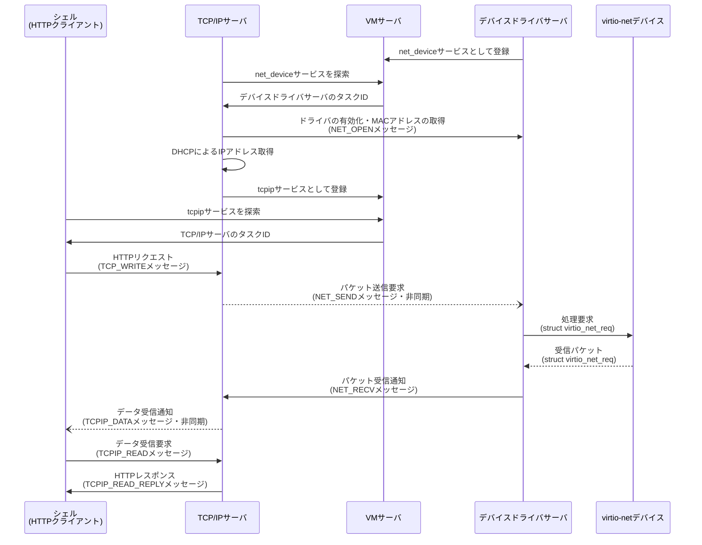

# HinaOSの内部構造

本ドキュメントは、ソースコードのファイル構成や動作の流れを通じて、HinaOSの土地勘をつかむことを目的としています。

## リポジトリの構成

```
.
├── fs                -- HinaFSの内容
├── kernel            -- カーネル
│   └── riscv32       -- カーネルのCPUアーキテクチャ依存部分 (32ビットRISC-V用)
├── libs              -- ライブラリ
│   ├── common        -- カーネル・ユーザーランド共通のライブラリ
│   │   └── riscv32   -- commonライブラリのCPUアーキテクチャ依存部分 (32ビットRISC-V用)
│   └── user          -- ユーザーランド用ライブラリ
│       ├── riscv32   -- userライブラリのCPUアーキテクチャ依存部分 (32ビットRISC-V用)
│       └── virtio    -- virtioデバイスドライバのためのライブラリ
├── mk                -- ビルドシステム関連
├── servers           -- サーバ・アプリケーション
│   ├── crack         -- HinaOSの脆弱性を実証するプログラム
│   ├── fs            -- HinaFSファイルシステムサーバ
│   ├── hello         -- Hello Worldを表示するプログラム
│   ├── hello_hinavm  -- HinaVM上でサンプルプログラム (pongサーバ) を起動するプログラム
│   ├── pong          -- pongサーバ (シェルのpingコマンドの通信先)
│   ├── shell         -- コマンドラインシェル
│   ├── tcpip         -- TCP/IPサーバ
│   ├── virtio_blk    -- virtio-blk ストレージデバイスドライバ
│   ├── virtio_net    -- virtio-net ネットワークデバイスドライバ
│   └── vm            -- VMサーバ: メモリ管理、タスク管理など (最初に起動するサーバ)
└── tools             -- 雑多なビルド・開発用スクリプト
```

## HinaOSカーネルの基本動作

カーネルはイベント駆動型で動作します。「イベント」にはシステムコール、ページフォルトを始めとする例外、キーボードなど周辺デバイスからの割り込みなどがあります。

イベントが発生すると、CPUは予めカーネルが設定しておいたイベントハンドラ (`riscv32_trap_handler`) に処理を移行します。カーネルは実行状態を保存した後にイベントに応じた処理を行い、ユーザータスクに処理を戻します。実行中タスクがブロック状態に入ったり、割り当てられたCPU時間を使い切ったりした場合は、コンテキストスイッチを行い、別のタスクを実行します。

また、カーネルの処理を始める際に「ビッグカーネルロック ([Wikipedia](https://ja.wikipedia.org/wiki/ジャイアントロック))」と呼ばれる単一ロックを取ります。そのため、カーネルのコードは基本的に1つのCPUでしか実行されません。この単純な仕組みのおかげで、ロックを意識せずにカーネルを書けるようになっています。

## アプリケーション・サーバの基本動作

アプリケーションやサーバも、カーネルと同じようにシングルスレッド・イベント駆動型で動作します。特にサーバでは、クライアントタスクからのメッセージの受信、メッセージの種類に応じた処理の実行、クライアントタスクへのメッセージの返信という流れが基本となります。

各サーバ・アプリケーションはVMサーバから起動されます。VMサーバは各ユーザータスクの「ページャタスク」として、ページフォルトや異常処理 (無効なポインタの参照など) といったイベントを処理するのが仕事です。

タスク同士はメッセージパッシング経由で通信しあいます。メッセージは単純なバイト列であり、メッセージの種類や内容は `messages.idl` というHinaOS独自のシンプルなインターフェイス記述言語で定義されます。また、メッセージパッシングとは別に通知IPC (notifications) という仕組みもカーネルは提供しています。

メッセージパッシングは同期的に行われ、メッセージの送信処理は宛先タスクが受信状態に入るまでブロックします。ただし、タスク同士が互いにメッセージを同期的に送ろうとするとデッドロックを起こしてしまうため、非同期メッセージパッシングも一部で使われています。

## Hello Worldの一生



## タスクの一生



## 同期的メッセージの一生



## 非同期メッセージの一生



## パケットの一生


